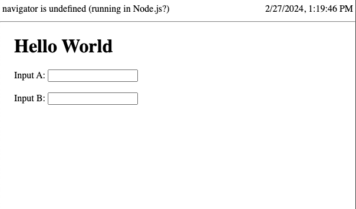

# Example Framework

This example consists of an extremely minimalistic simple representation of a fullstack framework application with its Vite plugin.

It produces the following (server side rendered) html page:



The application can be run using the node or workerd runtimes by respectively running:

```sh
$ npm run dev:node
```

and

```sh
$ npm run dev:workerd
```

and you can see from the text at the top of the page what runtime is being used to ssr the html.

## Structure

The files/directories in the project are:

```
.
├── src
│   ├── client
│   └── server
|
├── entry-node.ts
├── entry-workerd.ts
```

- `entry-node.ts`

  Implements a minimalistic entrypoint that gets run with the
  [`executeEntrypoint` function](https://vitejs.dev/guide/api-vite-runtime#viteruntime) in the node runtime
  and imports files from `src` (specifically `src/server`).

- `entry-workerd.ts`

  Implements a minimalistic entrypoint that gets run with the
  [`executeEntrypoint` function](https://vitejs.dev/guide/api-vite-runtime#viteruntime) in the workerd runtime
  and imports files from `src` (specifically `src/server`).

- `src/server`

  Contains server side code that generates the html that gets shipped
  to the browser (simulating an SSR-like flow).

  The generated html includes files from `src/client`

- `src/client`

  Contains client side code that is included in the html code that gets
  shipped to the browser, providing an example of browser-only client side
  code.

## HMR

Both client/browser side and server side HMR work.

The client/browser side one working as you'd expect it to (replacing the module in the browser by keeping its state).

The server side one only console logging what server side file has changed (as it is not clear to us how and what best should happen in such HRM).

## The `exampleFramework` Plugin

Please note that in this example, in the `vite.config.js` we define a `exampleFramework` plugin that runs the application.

So this example includes both the actual user application and the "framework" plugin used to serve the application with Vite.

This is not realistic as the two would generally be two different projects, but for the sake of simplicity we've combined them into a single one here.
