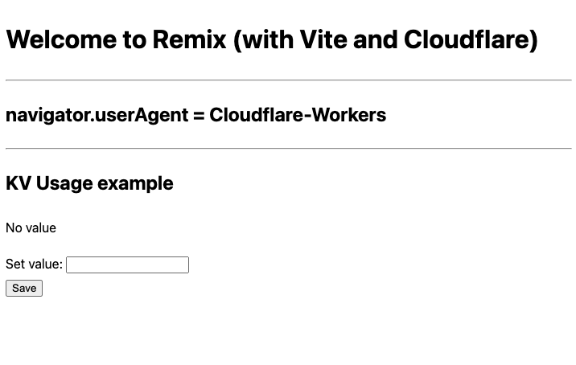

# Remix App Framework

This example shows how a Remix application can be locally fully server side rendered inside workerd.

It produces the following (server side rendered) html page:



and showcases that use of actions and loaders to interact with a KV binding.

To run the application simply run:

```sh
$ pnpm dev
```

> [!NOTE]
>
> To make this work changes had to be made in the `@remix-run/dev` package, those are applied with a pnpm patch
>
> you can see the source code used to generate such patch here: https://github.com/dario-piotrowicz/remix/tree/vite-runtime-5.1-experimentations-with-node
